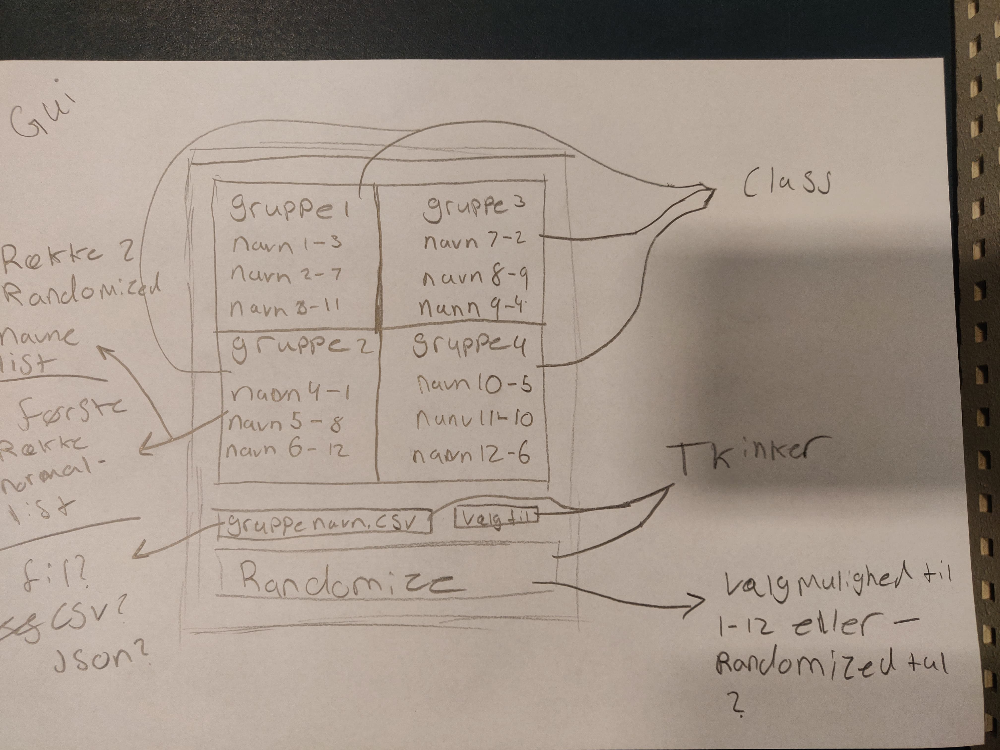
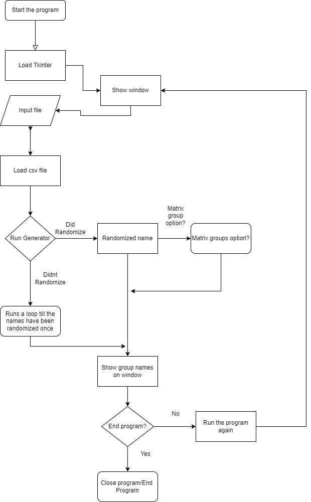

# Group Generator
Af chris92g4 og MightGit

### Kort info omkring projektet
Denne projekt er vores eksamens projekt hvor vi valgte at arbejde med oplæg 3 fra oplæget.
Vi har valgt at lave en generator som danner grupper for specifik dansk klassen, men det er muligt at bruges i andre klasser også.

Først har vi lavet en Tidsplan som har givet os en overview over vores opgave, hvor vi kan se hvad der skal blive lavet og hvad vi mangler.
https://trello.com/b/WIiKkj18/generator

I trello har vi givet hver en af sine panaler, hvor vi har givet dem hver sine punkter og tidspunkt på hvor de skal blive færdigt med hvem der er sat på hver sin opgave.
Ud fra vores trello og hvad vi har valgt, har vi valgt at lave en flowchart der kunne passe ind til det, og en GUI.

### Metoder

I denne projekt har vi valt at bruge disee følgende metoder i vores program og til projektet generelt.

Vi har brugt TKinter, flowhcart, GUI, UML Diagram, Trello.  
Kode metoder kommer senere.

## GUI

I vores GUI har vi sat op et program som har vores prototype af hvordan vi har valgt at have vores program sat op. Det vi har skrevet lige nu
er at vi har sat den op på hvordan vi tror vi kan få den til at se ud til sidst. Det er en prototype som giver os en ide om hvordan vi skal lave vores program med metoden TKinter.

## Flowchart

I forhold til vores flwowchart, har vi lavet en design som har givet os en indblik til hvordan programmet skal se ud.
Denne flowchart er ikke den sidste flowchart vi lavet, siden den her er vores hvordan vores program skal virke optimalt. 

Design-wise har vi opstillet den så at programmet har en startspunkt og en sluts punkt, med et punkt hvor den kan gå tilbage til starts punktet så den kan blive reloaded uden at man skal slukke og åbne igen.

